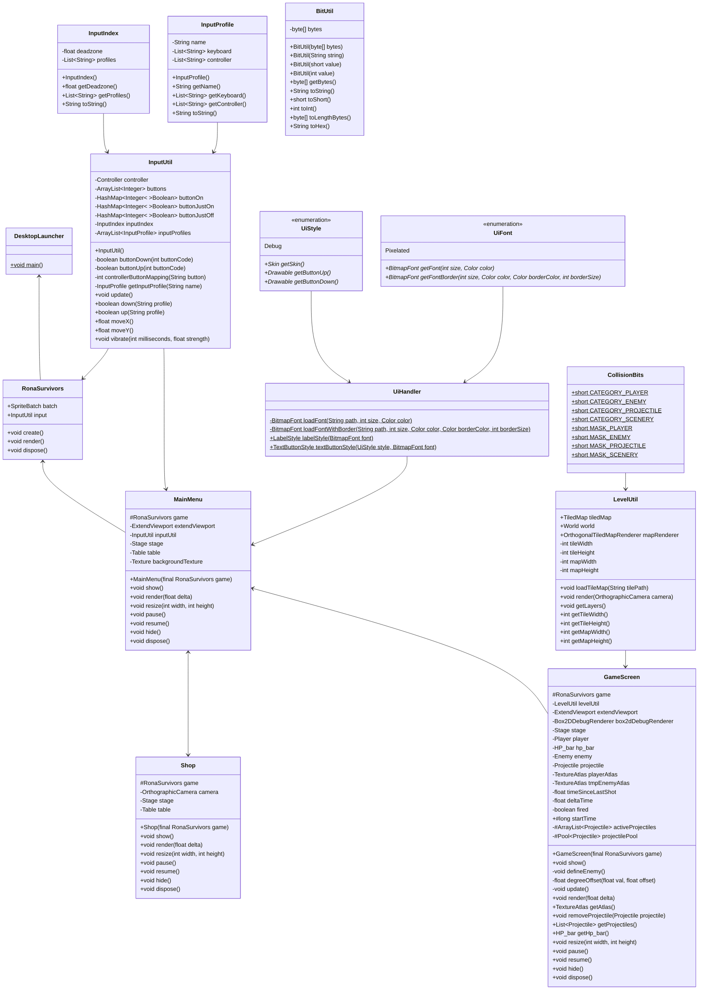

 

README.md-filen skal (gjennom hele semesteret) holdes oppdatert med:

navn på team-medlemmene, teamet og prosjektet, samt gruppenummer
kort beskrivelse av spillet og hvordan det brukes (f.eks. hvilke tastetrykk som gjør hva).
hvordan koden kjøres.
hvor evt. grafikk/lyd-ressurser er hentet fra.

# INF112 Project – *Rona Survivors*

* Team: *Mavenless* (Gruppe 4.1): *Askild Heiret, Beate Skogvik, Kristian Fredrik Rognsvaag, Kristian Skeie, Tobias Husebø*
* Lenke til GitLab/Trello/etc.

## Om spillet
Du er en lege som må kjempe deg gjennom alt en pandemi kan kaste mot deg. 

## Kjøring
* Kompileres med `./make.py -d` (alias/helper for abstracion)
* Kjøres med `./make.py -r` (evt. `./gradlew desktop:run`)
* Krever Java 8

## Kjente feil
* Projectile colliding with other projectiles 

## Credits
Ingenting hittil 😎
<!-- Tileset fra https://opengameart.org/content/2d-cave-platformer-tileset-16x16 -->

## Development-style og Rollefordeling:
* Development-style: *Scrum*
1. *Scrum-master* @Kristian.Rognsvaag
- En Scrum-master har i et større prosjekt mange funksjoner, men de vi velger å fokusere på i vårt mindre prosjekt er:

    - Sikrer Scrum-metodikken blir brukt for å guide teamet
    - Vi vil fokusere på å bruke "Daily Scrum", som vil være ca. 2 ganger ukentlig med vår arbeidsmengde.
    - Vi ser på de obligatoriske innleveringene som våre "sprinter" 

2. *Dev. Team-member* @Askild.Heiret
    - UX/UI ansvarlig: ansvar for brukervenlighet, layout og visual design. 

3. *Dev. Team-member* @Kristian.Skeie
    - Test ansvarlig: ansvar for produktkvalitet

4. *Dev. Team-member* @Tobias.Husebo
    -   Software arkitekt: beslutningstaker når det gjelder ordning av programvaren
    
5. *Dev. Team-member* @Beate.Skogvik
    - Kundekontakt: kontakt med gruppeleder for å vite hva som forventes til hver obligatoriske innlevering

Links to Trello: 

[TRELLO ISSUES](https://trello.com/b/QHYMXsMK/issues)

[TRELLO TASKS](https://trello.com/b/0YPRkMZo/tasks)

## Klassediagram
