 

# INF112 Project – *Rona Survivors*

* Team: *Mavenless* (Gruppe 4.1): *Askild Heiret, Beate Skogvik, Kristian Fredrik Rognsvaag, Kristian Skeie, Tobias Husebø*

## Om spillet
Du er en lege som må kjempe deg gjennom alt en pandemi kan kaste mot deg. 

`w - gå oppover`

`s - gå nedover`

`a - gå mot venstre`

`d - gå mot høyre`

`esc - avslutter spillet`

## Kjøring
* Kompileres med `./make.py -d` (alias/helper for abstracion)
* Kjøres med `./make.py -r` (evt. `./gradlew desktop:run`)
* Krever Java 8

## Kjente feil

- Ingenting 😎

## Credits

- [CREDITS](https://git.app.uib.no/mavenless/rona-survivors/-/blob/main/credits.csv)

## Klassediagram

```mermaid
classDiagram
    DesktopLauncher <-- RonaSurvivors
    RonaSurvivors <--> MainMenuScreen
    MainMenuScreen <-- GameScreen
    MainMenuScreen <--> InstructionsScreen
    RonaSurvivors --> GameScreen
    RonaSurvivors --> InstructionsScreen
    InputUtil --> RonaSurvivors
    InputUtil --> MainMenuScreen
    UiHandler --> MainMenuScreen
    UiHandler --> InstructionsScreen
    LevelUtil --> GameScreen
    Save --> GameScreen
    Projectile --> GameScreen
    Player <--> GameScreen
    HP_bar --> GameScreen
    Enemy --> GameScreen
    CollisionHandler <--> GameScreen
    GameScreen --> GameOverScreen
    GameOverScreen <-- MainMenuScreen

    InputIndex --> InputUtil
    InputProfile --> InputUtil

    UiStyle --> UiHandler
    UiFont --> UiHandler

    CollisionBits --> LevelUtil

    SaveData --> Save
    SaveUtil --> Save
    BitUtil --> SaveUtil

    LevelUtil --> Projectile

    State --> Player
    InputUtil --> Player
    LevelUtil --> Player

    LevelUtil --> Enemy

    CollisionBits --> CollisionHandler

    %% Startup
    class DesktopLauncher {
        +void main()$
    }

    class RonaSurvivors {
        +SpriteBatch batch
        +InputUtil input

        +void create()
        +void render()
        +void dispose()
    }

    %% Screens
    class MainMenuScreen {
        -Skin skin
        -Stage stage
        -RonaSurvivors game

        +MainMenuScreen(RonaSurvivors game)
        +void create()
        -TextButton startButton()
        -TextButton instructionsButton()
        -TextButton exitButton()
        +void render(float arg0)
        +void resize(int width, int height)
        +void dispose()
        +void hide()
        +void pause()
        +void resume()
        +void show()
    }

    class InstructionsScreen {
        -Skin skin
        -Stage stage
        -RonaSurvivors game

        +InstructionsScreen(RonaSurvivors game)
        -void create()
        -TextButton backButton()
        -TextButton insButton(String str)
        +void dispose()
        +void hide()
        +void pause()
        +void render(float arg0)
        +void resize(int width, int height)
        +void resume()
        +void show()
    }

    class GameOverScreen {
        -Skin skin1
        -Stage stage
        -RonaSurvivors game
        -Integer kills

        +GameOverScreen(RonaSurvivors game, Integer kills)
        +void create()
        +void render(float arg0)
        +void resize(int width, int height)
        +void dispose()
        +void hide()
        +void pause()
        +void resume()
        +void show()
    }

    class GameScreen {
        #RonaSurvivors game
        -LevelUtil levelUtil
        -ExtendViewport extendViewport
        -Box2DDebugRenderer box2dDebugRenderer
        -Stage stage
        -Player player
        -HP_bar hp_bar
        -Enemy enemy
        -Projectile projectile
        -TextureAtlas playerAtlas
        -TextureAtlas tmpEnemyAtlas
        -float timeSinceLastShot
        -float deltaTime
        -boolean fired
        +#long startTime
        -#ArrayList~Projectile~ activeProjectiles
        -#Pool~Projectile~ projectilePool

        +GameScreen(final RonaSurvivors game)
        +void show()
        -void defineEnemy()
        -float degreeOffset(float val, float offset)
        -void update()
        +void render(float delta)
        +TextureAtlas getAtlas()
        +void removeProjectile(Projectile projectile)
        +List~Projectile~ getProjectiles()
        +HP_bar getHp_bar()
        +void resize(int width, int height)
        +void pause()
        +void resume()
        +void hide()
        +void dispose()
    }

    %% Utils
    class InputUtil {
        -Controller controller
        -ArrayList~Integer~ buttons
        -HashMap~Integer~ ~Boolean~ buttonOn
        -HashMap~Integer~ ~Boolean~ buttonJustOn
        -HashMap~Integer~ ~Boolean~ buttonJustOff
        -InputIndex inputIndex
        -ArrayList~InputProfile~ inputProfiles

        +InputUtil()
        -boolean buttonDown(int buttonCode)
        -boolean buttonUp(int buttonCode)
        -int controllerButtonMapping(String button)
        -InputProfile getInputProfile(String name)
        +void update()
        +boolean down(String profile)
        +boolean up(String profile)
        +float moveX()
        +float moveY()
        +void vibrate(int milliseconds, float strength)
    }

    class InputIndex {
        -float deadzone
        -List~String~ profiles
        +InputIndex()
        +float getDeadzone()
        +List~String~ getProfiles()
        +String toString()
    }

    class InputProfile {
        -String name
        -List~String~ keyboard
        -List~String~ controller

        +InputProfile()
        +String getName()
        +List~String~ getKeyboard()
        +List~String~ getController()
        +String toString()
    }

    class BitUtil {
        -byte[] bytes

        +BitUtil(byte[] bytes)
        +BitUtil(String string)
        +BitUtil(short value)
        +BitUtil(int value)
        
        +byte[] getBytes()
        +String toString()
        +short toShort()
        +int toInt()
        +byte[] toLengthBytes()
        +String toHex()
    }

    class UiHandler {
        -BitmapFont loadFont(String path, int size, Color color)$
        -BitmapFont loadFontWithBorder(String path, int size, Color color, Color borderColor, int borderSize)$
        +LabelStyle labelStyle(BitmapFont font)$
        +TextButtonStyle textButtonStyle(UiStyle style, BitmapFont font)$
    }

    class UiStyle {
        <<enumeration>>
        Debug
        +Skin getSkin()*
        +Drawable getButtonUp()*
        +Drawable getButtonDown()*
    }

    class UiFont {
        <<enumeration>>
        Pixelated
        +BitmapFont getFont(int size, Color color)*
        +BitmapFont getFontBorder(int size, Color color, Color borderColor, int borderSize)*
    }

    class LevelUtil {
        +TiledMap tiledMap
        +World world
        +OrthogonalTiledMapRenderer mapRenderer
        -int tileWidth
        -int tileHeight
        -int mapWidth
        -int mapHeight

        +void loadTileMap(String tilePath)
        +void render(OrthographicCamera camera)
        +void getLayers()
        +int getTileWidth()
        +int getTileHeight()
        +int getMapWidth()
        +int getMapHeight()
    }

    class SaveUtil {
        +boolean writeBytesToFile(String path, byte[] bytes)$
        +byte[] readBytesFromFile(String path)$
        +void writeObject(String signature, short version, Object object, String saveLocation)$
        +Object readObject(String signature, short version, String saveLocation)$
        +String getDefaultSavePath()$
    }

    %% Game
    class CollisionBits {
        +short CATEGORY_PLAYER$
        +short CATEGORY_ENEMY$
        +short CATEGORY_PROJECTILE$
        +short CATEGORY_SCENERY$

        +short MASK_PLAYER$
        +short MASK_ENEMY$
        +short MASK_PROJECTILE$
        +short MASK_SCENERY$
    }

    class SaveData {
        +String name
        +float strength
        +SaveData(String name, float strength)
    }

    class Save {
        -String saveLocationSaves
        -String signature
        -short version
        -SaveData saveData
        +Save()
        +void write()
        +void read()
    }

    class Projectile {
        -Sprite sprite
        -Rectangle size
        -Body body
        -float speed
        -Fixture projectileFix
        -LevelUtil levelUtil
        -Texture projectileText
        -Player player
        -boolean alive
        -float activeTime

        +Projectile(Rectangle size, float speed, LevelUtil levelUtil)
        -void defineProjectile()
        +void render(SpriteBatch batch)
        +void update()
        +void init(float angle)
        +Rectangle getSize()
        +Body getBody()
        +Sprite getSprite()
        +Vector2 getPosition()
        +Texture getTexture()
        +boolean getIsAlive()
        +float getActiveTime()
        +void dispose()
        +void reset()
    }

    class State {
        <<enumeration>>
        STANDING
        RUNNINGHORIZONTAL
        STANDINGLEFT
        STANDINGRIGHT
        RUNNINGUP
        RUNNINGDOWN
    }

    class Player {
        -LevelUtil levelUtil
        -TextureAtlas atlas
        -State currentState
        -State previousState
        -Rectangle size
        -float speed
        -float stateTimer
        -Body body
        -Fixture playerFix
        -Animation~TextureRegion~ runHorizontal
        -Animation~TextureRegion~ runUp
        -Animation~TextureRegion~ runDown
        -TextureRegion standing
        -Boolean isRunningLeft
        -Boolean isStanding
        -Boolean isAudioPlaying
        -InputUtil input
        -String playerName
        -Sound sound
        -long soundId

        +Player(GameScreen screen, Rectangle size, float speed, LevelUtil levelUtil, InputUtil input)
        -void definePlayer()
        +void move(Camera camera, float worldWidth, float worldHeight)
        -TextureRegion getFrame()
        -void getAudio(State state)
        -State getState()
        +void render(SpriteBatch batch)
        +Rectangle getSize()
        +float getSpeed()
        +Vector2 getPosition()
        +void setSpeed(float speed)
        +void dispose()
    }

    class HP_bar {
        #int MAX_HEALTH
        -int health
        -ProgressBar HpBar

        +HP_bar(int initHealth, Stage stage)
        -void init_HpBar(Stage stage)
        +void setHealth(int h)
        +int getHealth()
        +float getWidth()
    }

    class Enemy {
        -Rectangle size
        -Sprite sprite
        -float speed
        -Body body
        -Fixture enemyFix
        -LevelUtil levelUtil

        +Enemy(Rectangle size, Sprite sprite, float speed, LevelUtil levelUtil)
        -void defineEnemy()
        +void move(Vector2 player_pos)
        +void render(SpriteBatch batch)
        +Rectangle getSize()
        +Body getBody()
        +Sprite getSprite()
        +float getSpeed()
        +Vector2 getPosition()
        +void dispose()
    }

    class CollisionHandler {
        -GameScreen gameScreen

        +CollisionHandler(GameScreen gameScreen)
        +void beginContact(Contact contact)
        +void endContact(Contact contact)
        +void preSolve(Contact contact, Manifold oldManifold)
        +void postSolve(Contact contact, ContactImpulse impulse)
    }
```

