# Prosjektrapport

## Gruppemøte 13.03.2023 (08.15-10.00)

Alle gruppemedlemer tilstede 

- Gikk igjennom tilbakemeldinger fra gruppeleder på oblig1.
- Her fikk vi trekk på rollefordeling, og forklaring på hva rollene innebærer og har derfor utbedret dette. 

**Diskutert hva som er viktig å fokusere videre på** 
- Testing står høyt på listen siden vi har kommet sent i gang med dette. 

**Forbedringspunkt for denne sprinten**

1. Roller
2. Kontroll på hva som trengs hver innlevering 
3. Planlegge hva man skal jobbe mellom hver gang. Hittil har vi hatt generelle tema, men kanskje mer spesifikke oppgaver. (Bruke Trello mer)

## Gruppemøte 16.03.2023 (12.00-14.00)

Alle gruppemedlemer tilstede 

- Starter dagen med å snakke om hva vi har gjort siden sist
- Effektiv gruppetime,der vi setter i gang å jobbe med ulike oppgaver. 

**Jobbet med i gruppetimen, og fokus til neste time**

- Kristian x2: Jobbe med editor for player, enemies og items 
- Askild og Beate: Fortsette med skincomposer (UI design)
- Tobias: HP-bar

**Roller diskusjon**

- Vi trenger en som har en mer ansvarlig rolle i forhold til å passe på hva som skal med til innleveringer. 
- Siden Beate er kundekontakt tar hun nå mer ansvar for å delegere ut mer som må gjøres direkte i forhold til innleveringer.
- Ellers er folk fornøyd med rollene på dette tidspunktet. 

**Ting vi må finne ut av**

- Fått en rolle som tar mer ansvar for selve oblig-innleveringene 
- Gå i gruppetime for å finne ut av hva/hvordan vi skal teste.
- Ellers fungerer gruppedynamikken godt, vi har god dialog og alle gir en innsats. 

## Gruppemøte 20.03.2023 (08.15-10.00)

Alle gruppemedlemmer til stede

**Jobbet med i gruppetimen, og fokus til neste time**

Spurte gruppeleder om hvordan vi skal gjøre tester, siden det ikke er mulig å teste 
det grafiske. Fikk da beskjed om at vi kan gjøre manuelle tester for det grafiske.

- Kristian R: Jobbe med editor for player, enemies og items 
- Kristian S: Research Audio
- Beate: Projectile
- Tobias: HP-bar
- Askild: Skincomposer 

**Ting vi må finne ut av**

- Bli flinkere å bruke trello

## Gruppemøte 23.03.2023 (10.00-14.00)

Alle gruppemedlemmer til stede (Tobias gyldig fravær)

- Kristian R: Ordne Assests system 
- Kristian S: Audio
- Beate: Projectile
- Askild: UI design 

**Ting vi må finne ut av**

- Bli flinkere å bruke trello 

## Gruppemøte 30.03.2023 (10.00-14.00)

Alle gruppemedlemmer til stede

- Kristian R: Ordne Assests system 
- Kristian S: Projectile
- Beate: Projectile
- Askild: UI design implementering 
- Tobias: HP-bar

## Gruppemøte 13.04.2023 (10.00-14.00)

Alle gruppemedlemmer til stede 

- Diskuterer tilbakemeldinger fra sist oblig
- Finner ut hva som må fikses til neste oblig 

- Alle må dokumentere sine public metoder 
- Alle må gå inn å slette kode som er kommentert ut, dersom det er en grunn til at den står der skriv en kommentar på det. 

**Ting vi må finne ut av**

- Vi har blitt litt flinkere til å bruke trello, men et mål for neste oblig er å få inn alle tasks inn i forhold til hva som mangler. Siden vi ikke har gjort dette tidligere er det kanskje ikke så rart at vi har vært dårlige på å bruke trello. Forhåpentligvis vil dette også gjøre det lettere å finne oppgaver man kan gjøre, når man er litt usikker på hva som burde prioriteres. 

# Krav og spesifikasjon

**Hvilke krav vi har prioritert og hva vi har gjort siden forrige gang:**

### MVP (minimum viable product):  

1. Vise et spillebrett (fullført)
2. Vise spiller på spillbrettet  (fullført)
3. Flytte spiller i alle retninger  (fullført)
4. Fiender som går i mot spiller (fullført)
5. Spiller kan skyte automatisk (fullført)
6. Spiller kan dø/få mindre HP (ved kontakt med fiender)
7. Fiender blir sterkere over tid
8. Spillfigur kan få oppgraderinger underveis 
9. Mål for spillbrett: få nok poeng
10. Låser opp nytt spillbrett/nytt nivå 
11. Start-skjerm ved oppstart. Kan kjøpe permanente oppgraderinger for opptjente penger. 

### Brukerhistorier vi har jobbet med denne obligen:
2. Som en spiller, vil jeg ha en HP-bar, slik at fiender blir en hindiring og at spillet har et klart mål.
3. Som en spiller, vil jeg ha muligheten til å skyte mot forskjellige typer fiender, som blir sterkere, i tillegg til at jeg skal kunne bruke forskjellige våpen og ferdigheter, slik at jeg kan utfordre meg selv og gjøre fremgang i spillet.

### Akseptansekriterier:

<em>Akseptanse kriterie for brukerhistorie 2:</em>
* Spilleren kan unngå fiender med å forflytte seg rundt på spillbrettet. (Fullført)
* Fiender er til stede på brettet og kan følge spilleren. (Delvis fullført med 1 fiende)
* Fiender skal kunne skade spilleren, og spillerens helse skal vise. (Delvis fullført, spiller tar kun skade når kontakt oppstår, ikke under hele kontakten)

<em>Akseptanse kriterie for brukerhistorie 3:</em>
* Spillet skal tilby spilleren en mulighet for å skyte fiender. (Delvis fullført, fiender tar enda ikke skade)
* Spillet skal tilby ulike typer oppgraderinger som en spiller kan skaffe seg, som f.eks.: rustning, våpen, eller tilbehør, for å styrke spilleren.
* Spillet skal tilby en klar oversikt over hva og hvor mye en oppgradering skal forbedre en spillers egenskaper.

### Oppsummering 
- Jobbet med projectile, den skal skyte ut i fra hvilken vei spilleren er rettet. 
- Jobbet med HP-bar slik at vi kan begynne å implementere at spiller skal ta skade osv. Hittil tar spiller skade når kontakt oppstår, men ikke når den vedvarer. Spilleren kan heller ikke dø. 
- Jobbet med å lage ulike screens, slik at man kan velge character før man begynner spillet 
- Fått lagt til lyd på når spilleren går 

# Produkt kode 

**Dette har vi fikset siden sist** 

- [Manuelle tester](https://git.app.uib.no/mavenless/rona-survivors/-/blob/main/doc/manuelleTester.md)

- I tillegg har vi laget noen JUnit tester. 

- Links to Trello boards: 

    - [TRELLO ISSUES](https://trello.com/b/QHYMXsMK/issues)

    - [TRELLO TASKS](https://trello.com/b/0YPRkMZo/tasks)

- Alle skal ha kommentert ut kode som ikke brukes, eller kommentert på hvorfor det må bli stående 

- Alle skal ha fikset dokumentasjon på public metoder de selv har laget 

## Development-style og Rollefordeling:
* Development-style: *Scrum*
1. *Scrum-master* @Kristian.Rognsvaag
- En Scrum-master har i et større prosjekt mange funksjoner, men de vi velger å fokusere på i vårt mindre prosjekt er:

    - Sikrer Scrum-metodikken blir brukt for å guide teamet
    - Vi vil fokusere på å bruke "Daily Scrum", som vil være ca. 2 ganger ukentlig med vår arbeidsmengde.
    - Vi ser på de obligatoriske innleveringene som våre "sprinter" 

2. *Dev. Team-member* @Askild.Heiret
    - UX/UI ansvarlig: ansvar for brukervenlighet, layout og visual design. 

3. *Dev. Team-member* @Kristian.Skeie
    - Test ansvarlig: ansvar for produktkvalitet

4. *Dev. Team-member* @Tobias.Husebo
    -   Software arkitekt: beslutningstaker når det gjelder ordning av programvaren
    
5. *Dev. Team-member* @Beate.Skogvik
    - Kundekontakt: kontakt med gruppeleder for å vite hva som forventes til hver obligatoriske innlevering.  

## Klassediagram

```mermaid
classDiagram
    DesktopLauncher <-- RonaSurvivors
    RonaSurvivors <--> MainMenu
    MainMenu <--> Shop
    MainMenu <-- GameScreen
    RonaSurvivors --> GameScreen
    RonaSurvivors --> Shop
    InputUtil --> RonaSurvivors
    InputUtil --> MainMenu
    UiHandler --> MainMenu
    LevelUtil --> GameScreen
    Save --> GameScreen
    Projectile --> GameScreen
    Player <--> GameScreen
    HP_bar --> GameScreen
    Enemy --> GameScreen
    CollisionHandler <--> GameScreen

    InputIndex --> InputUtil
    InputProfile --> InputUtil

    UiStyle --> UiHandler
    UiFont --> UiHandler

    CollisionBits --> LevelUtil

    SaveData --> Save
    SaveUtil --> Save
    BitUtil --> SaveUtil

    LevelUtil --> Projectile

    State --> Player
    InputUtil --> Player
    LevelUtil --> Player

    LevelUtil --> Enemy

    CollisionBits --> CollisionHandler

    %% Startup
    class DesktopLauncher {
        +void main()$
    }

    class RonaSurvivors {
        +SpriteBatch batch
        +InputUtil input

        +void create()
        +void render()
        +void dispose()
    }

    %% Screens
    class MainMenu {
        #RonaSurvivors game
        -ExtendViewport extendViewport
        -InputUtil inputUtil
        -Stage stage
        -Table table
        -Texture backgroundTexture

        +MainMenu(final RonaSurvivors game)
        +void show()
        +void render(float delta)
        +void resize(int width, int height)
        +void pause()
        +void resume()
        +void hide()
        +void dispose()
    }

    class Shop {
        #RonaSurvivors game
        -OrthographicCamera camera
        -Stage stage
        -Table table

        +Shop(final RonaSurvivors game)
        +void show()
        +void render(float delta)
        +void resize(int width, int height)
        +void pause()
        +void resume()
        +void hide()
        +void dispose()
    }

    class GameScreen {
        #RonaSurvivors game
        -LevelUtil levelUtil
        -ExtendViewport extendViewport
        -Box2DDebugRenderer box2dDebugRenderer
        -Stage stage
        -Player player
        -HP_bar hp_bar
        -Enemy enemy
        -Projectile projectile
        -TextureAtlas playerAtlas
        -TextureAtlas tmpEnemyAtlas
        -float timeSinceLastShot
        -float deltaTime
        -boolean fired
        +#long startTime
        -#ArrayList~Projectile~ activeProjectiles
        -#Pool~Projectile~ projectilePool

        +GameScreen(final RonaSurvivors game)
        +void show()
        -void defineEnemy()
        -float degreeOffset(float val, float offset)
        -void update()
        +void render(float delta)
        +TextureAtlas getAtlas()
        +void removeProjectile(Projectile projectile)
        +List~Projectile~ getProjectiles()
        +HP_bar getHp_bar()
        +void resize(int width, int height)
        +void pause()
        +void resume()
        +void hide()
        +void dispose()
    }

    %% Utils
    class InputUtil {
        -Controller controller
        -ArrayList~Integer~ buttons
        -HashMap~Integer~ ~Boolean~ buttonOn
        -HashMap~Integer~ ~Boolean~ buttonJustOn
        -HashMap~Integer~ ~Boolean~ buttonJustOff
        -InputIndex inputIndex
        -ArrayList~InputProfile~ inputProfiles

        +InputUtil()
        -boolean buttonDown(int buttonCode)
        -boolean buttonUp(int buttonCode)
        -int controllerButtonMapping(String button)
        -InputProfile getInputProfile(String name)
        +void update()
        +boolean down(String profile)
        +boolean up(String profile)
        +float moveX()
        +float moveY()
        +void vibrate(int milliseconds, float strength)
    }

    class InputIndex {
        -float deadzone
        -List~String~ profiles
        +InputIndex()
        +float getDeadzone()
        +List~String~ getProfiles()
        +String toString()
    }

    class InputProfile {
        -String name
        -List~String~ keyboard
        -List~String~ controller

        +InputProfile()
        +String getName()
        +List~String~ getKeyboard()
        +List~String~ getController()
        +String toString()
    }

    class BitUtil {
        -byte[] bytes

        +BitUtil(byte[] bytes)
        +BitUtil(String string)
        +BitUtil(short value)
        +BitUtil(int value)
        
        +byte[] getBytes()
        +String toString()
        +short toShort()
        +int toInt()
        +byte[] toLengthBytes()
        +String toHex()
    }

    class UiHandler {
        -BitmapFont loadFont(String path, int size, Color color)$
        -BitmapFont loadFontWithBorder(String path, int size, Color color, Color borderColor, int borderSize)$
        +LabelStyle labelStyle(BitmapFont font)$
        +TextButtonStyle textButtonStyle(UiStyle style, BitmapFont font)$
    }

    class UiStyle {
        <<enumeration>>
        Debug
        +Skin getSkin()*
        +Drawable getButtonUp()*
        +Drawable getButtonDown()*
    }

    class UiFont {
        <<enumeration>>
        Pixelated
        +BitmapFont getFont(int size, Color color)*
        +BitmapFont getFontBorder(int size, Color color, Color borderColor, int borderSize)*
    }

    class LevelUtil {
        +TiledMap tiledMap
        +World world
        +OrthogonalTiledMapRenderer mapRenderer
        -int tileWidth
        -int tileHeight
        -int mapWidth
        -int mapHeight

        +void loadTileMap(String tilePath)
        +void render(OrthographicCamera camera)
        +void getLayers()
        +int getTileWidth()
        +int getTileHeight()
        +int getMapWidth()
        +int getMapHeight()
    }

    class SaveUtil {
        +boolean writeBytesToFile(String path, byte[] bytes)$
        +byte[] readBytesFromFile(String path)$
        +void writeObject(String signature, short version, Object object, String saveLocation)$
        +Object readObject(String signature, short version, String saveLocation)$
        +String getDefaultSavePath()$
    }

    %% Game
    class CollisionBits {
        +short CATEGORY_PLAYER$
        +short CATEGORY_ENEMY$
        +short CATEGORY_PROJECTILE$
        +short CATEGORY_SCENERY$

        +short MASK_PLAYER$
        +short MASK_ENEMY$
        +short MASK_PROJECTILE$
        +short MASK_SCENERY$
    }

    class SaveData {
        +String name
        +float strength
        +SaveData(String name, float strength)
    }

    class Save {
        -String saveLocationSaves
        -String signature
        -short version
        -SaveData saveData
        +Save()
        +void write()
        +void read()
    }

    class Projectile {
        -Sprite sprite
        -Rectangle size
        -Body body
        -float speed
        -Fixture projectileFix
        -LevelUtil levelUtil
        -Texture projectileText
        -Player player
        -boolean alive
        -float activeTime

        +Projectile(Rectangle size, float speed, LevelUtil levelUtil)
        -void defineProjectile()
        +void render(SpriteBatch batch)
        +void update()
        +void init(float angle)
        +Rectangle getSize()
        +Body getBody()
        +Sprite getSprite()
        +Vector2 getPosition()
        +Texture getTexture()
        +boolean getIsAlive()
        +float getActiveTime()
        +void dispose()
        +void reset()
    }

    class State {
        <<enumeration>>
        STANDING
        RUNNINGHORIZONTAL
        STANDINGLEFT
        STANDINGRIGHT
        RUNNINGUP
        RUNNINGDOWN
    }

    class Player {
        -LevelUtil levelUtil
        -TextureAtlas atlas
        -State currentState
        -State previousState
        -Rectangle size
        -float speed
        -float stateTimer
        -Body body
        -Fixture playerFix
        -Animation~TextureRegion~ runHorizontal
        -Animation~TextureRegion~ runUp
        -Animation~TextureRegion~ runDown
        -TextureRegion standing
        -Boolean isRunningLeft
        -Boolean isStanding
        -Boolean isAudioPlaying
        -InputUtil input
        -String playerName
        -Sound sound
        -long soundId

        +Player(GameScreen screen, Rectangle size, float speed, LevelUtil levelUtil, InputUtil input)
        -void definePlayer()
        +void move(Camera camera, float worldWidth, float worldHeight)
        -TextureRegion getFrame()
        -void getAudio(State state)
        -State getState()
        +void render(SpriteBatch batch)
        +Rectangle getSize()
        +float getSpeed()
        +Vector2 getPosition()
        +void setSpeed(float speed)
        +void dispose()
    }

    class HP_bar {
        #int MAX_HEALTH
        -int health
        -ProgressBar HpBar

        +HP_bar(int initHealth, Stage stage)
        -void init_HpBar(Stage stage)
        +void setHealth(int h)
        +int getHealth()
        +float getWidth()
    }

    class Enemy {
        -Rectangle size
        -Sprite sprite
        -float speed
        -Body body
        -Fixture enemyFix
        -LevelUtil levelUtil

        +Enemy(Rectangle size, Sprite sprite, float speed, LevelUtil levelUtil)
        -void defineEnemy()
        +void move(Vector2 player_pos)
        +void render(SpriteBatch batch)
        +Rectangle getSize()
        +Body getBody()
        +Sprite getSprite()
        +float getSpeed()
        +Vector2 getPosition()
        +void dispose()
    }

    class CollisionHandler {
        -GameScreen gameScreen

        +CollisionHandler(GameScreen gameScreen)
        +void beginContact(Contact contact)
        +void endContact(Contact contact)
        +void preSolve(Contact contact, Manifold oldManifold)
        +void postSolve(Contact contact, ContactImpulse impulse)
    }
```

